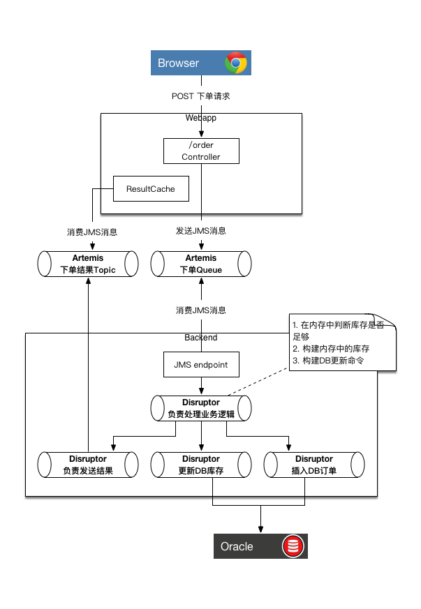
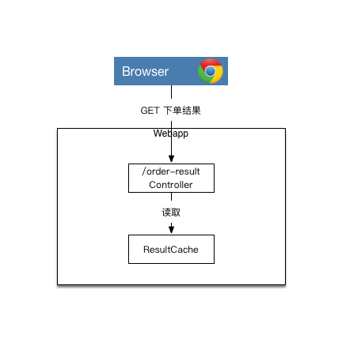

# artemis-disruptor-miaosha

没有redis也能够支撑["小米在印度把亚马逊搞挂了"事件](http://bbs.xiaomi.cn/t-13417592)的秒杀解决方案。

> 小米在印度打破了多项记录：
> 1. 4分钟内卖出了超过250,000台。 ---OPS:1042次抢购/S
> 1. 成为最快的手机抢购活动。
> 1. 抢购前我们收到了100万“到货提醒”。
> 1. 亚马逊每分钟收到超过500万个点击。
> 1. 亚马逊在这个期间每秒收到1500个订单（这是印度电商公司所有销售中最高的）。 ---OPS：1500次下单请求/S

## 性能表现

先说一下性能表现吧，因为大家对这个比较感兴趣。

硬件环境(Tomcat、Artemis、Jmeter、Oracle，backend都在这台电脑上)：

* MacBook Pro (Retina, 15-inch, Mid 2014)
* 2.2 GHz Intel Core i7
* 16 GB 1600 MHz DDR3
* 512G SSD

软件环境：

* java version "1.8.0_131"
* Artemis 1.5.4
* Oracle XE 11g (Docker)
* Tomcat 8.5.14 (1个)

相关配置见[如何准备环境](Environment.md)

测试Jmeter脚本见[如何Benchmark](Benchmark.md)：

* 300线程，循环1000次，共30w请求

一共Benchmark了两次，因为JIT的关系，第二次的性能表现更好。

**第一次结果**

* QPS：300000 in 00:01:57 = 2569.8/s Avg:   108 Min:     0 Max: 41102 Err:   164 (0.05%)
* TPS：299836订单 ／ 121秒 = 2477条/s

PS. 数据库表现从后端程序的日志中分析的。

**第二次结果**

不重启Tomcat和Artemis，把数据库的数据恢复后，重启了后端程序

* QPS：300000 in 00:00:35 = 8527.8/s Avg:    20 Min:     0 Max:  4515 Err:     2 (0.00%)
* TPS：246873订单 / 46 秒 = 5366条 / s

数据库记录数偏少是因为Artemis队列满了，把消息丢掉了。


## 架构说明

从部署拓扑上看，架构分为4个部分：

1. webapp，可集群部署，运行在Tomcat中
2. [ActiveMQ Artemis][Artemis]，负责webapp和backend之间的通信
3. backend，只能单个部署，独立运行，内部使用[Disruptor][Disruptor]
4. Oracle数据库

### ActiveMQ Artemis

[ActiveMQ Artemis][Artemis]是JBoss把HornetQ捐赠到Apache基金会后改名的项目，目前是ActiveMQ下的子项目。

HornetQ是当年大名鼎鼎的高性能消息中间件，因此[ActiveMQ Artemis][Artemis]也具备相当的性能表现。

本项目利用它做webapp和backend之间的消息通信。

### Disruptor

[Disruptor][Disruptor]是LMAX公司开源的高性能内存队列。[Disruptor][Disruptor]能够让开发人员只需写单线程代码，就能够获得非常强悍的性能表现，同时避免了写并发编程的难度和坑。
其本质思想在于多线程未必比单线程跑的快。

backend利用它把从[ActiveMQ Artemis][Artemis]获得请求串行化，判断商品库存是否充足，更新剩余库存，最后异步写入数据库。

### 使用内存、避免IO

本项目对于库存是否充足的判断既不在数据库层面，也没有利用redis，更不涉及任何IO。

backend程序在启动时将数据库中的库存数据加载到内存中，库存充足判断、更新剩余库存的动作都是在内存中进行的，配合[Disruptor][Disruptor]绕过了并发编程的内存可见性、同步、锁等问题，性能非常强。

也许有人会说，在实际项目中把商品信息都放到内存中不现实，怕会发生OOM，其实这个要看具体情况。

在本项目中商品在内存中相关类是[Item.java][Item]，在利用[jol-cli][jol-cli]([点此下载][jol-cli-dl])查看其memory-layout后发现，其大小为24byte：

```
me.chanjar.jms.server.memdb.Item object internals:
 OFFSET  SIZE  TYPE DESCRIPTION                    VALUE
      0    12       (object header)                N/A
     12     4   int Item.amount                    N/A
     16     4  Long Item.id                        N/A
     20     4       (loss due to the next object alignment)
Instance size: 24 bytes
Space losses: 0 bytes internal + 4 bytes external = 4 bytes total
```

而``Long``占用的内存也为24b：

```
java.lang.Long object internals:
 OFFSET  SIZE  TYPE DESCRIPTION                    VALUE
      0    12       (object header)                N/A
     12     4       (alignment/padding gap)        N/A
     16     8  long Long.value                     N/A
Instance size: 24 bytes
Space losses: 4 bytes internal + 0 bytes external = 4 bytes total
```

假设你有100W商品需要秒杀，那么其占用内存 = 1,000,000 * (24b + 4b + 24b) = 52,000,000b = 49m。仅仅只占49m。


## 优化项

架构上的优化点

1. 下单请求异步处理，请求返回的本次请求的ID，客户端拿这个ID到另行发起请求查询结果
1. 在秒杀期间，商品库存信息在内存中，库存判断及库存扣减都在内存中进行，之后异步到数据库
1. 利用Disruptor将并发请求串行化，同时避免了多线程编程复杂度
1. 抛弃数据库事务，采用最终一致性

和JMS相关的优化点

1. 重用JMS Connection、Session、MessageProducer、MessageConsumer，而不是每次都创建这些对象(Spring的JmsTemplate就是这么干的)
1. 将JMS Session设定为transacted=false, AUTO_ACKNOWLEDGE
1. 发送JMS消息时DeliveryMode=NON_PERSISTENT
1. 关闭Artemis的重发、消息持久机制

和JDBC相关的优化点

1. 使用JDBC Batch Update，减少和数据库网络IO的次数
1. 优化更新商品库存的DB操作，在高并发情况下，将针对同一个商品的更新库存操作合并成一条update，而不是多个update（借助于Disruptor）

和Tomcat相关的优化点

1. 调大maxThreads参数

## 流程说明

本项目只提供了两个接口：

1. 下单接口。用于下单。
2. 查询下单结果的接口。用于查询下单是否成功。

聪明的读者肯定已经想到了，整个秒杀过程是异步的。

### 下单流程



### 查询下单结果的流程

  


## How-tos

* [如何准备环境](Environment.md)
* [如何构建](Build.md)
* [如何启动](Run.md)
* [如何Benchmark](Benchmark.md)
* [关于崩溃恢复方案](Recover_Solution.md)


 [Artemis]: http://activemq.apache.org/artemis/
 [Disruptor]: https://lmax-exchange.github.io/disruptor/
 [Item]: jms-server/src/main/java/me/chanjar/jms/server/memdb/Item.java
 [jol-cli]: http://openjdk.java.net/projects/code-tools/jol/
 [jol-cli-dl]: http://central.maven.org/maven2/org/openjdk/jol/jol-cli/0.8/jol-cli-0.8-full.jar
